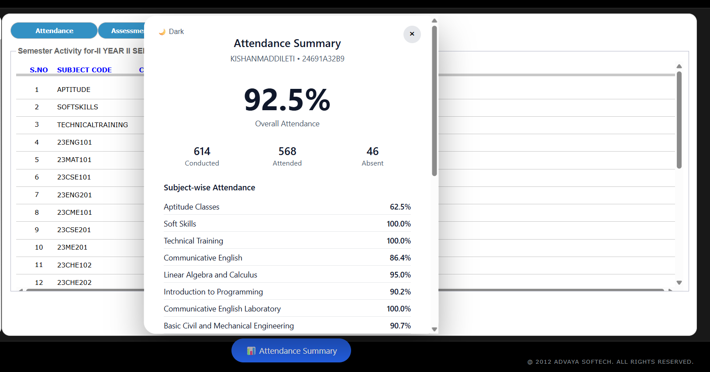

# GEMS Attendance Tracker

A lightweight Chrome extension for students of **Madanapalle Institute of Technology & Science (MITS)** to view attendance in a clean, simple, and distraction-free way.

---

## ✨ Features

- Overall attendance percentage
- Subject-wise attendance with subject names
- Total classes conducted, attended, and absent
- Clean and minimal UI (no analytics clutter)
- Dark / Light theme toggle
- Works fully on the client side

---

## 🧑‍🎓 Who is this for?

Students who use the **GEMS student portal** and want a quick, clear view of their attendance without manual calculations.

---

## 🔒 Privacy & Safety

- This extension does **not** store passwords
- No data is sent to any server
- No tracking or analytics
- All calculations happen locally in your browser
- Reads only data already visible after login

---

## 🛠️ Installation (Manual – 2 Minutes)

1. Download this repository as ZIP  
2. Extract the ZIP file  
3. Open Chrome and go to:

    chrome://extensions

4. Enable **Developer mode** (top right)
5. Click **Load unpacked**
6. Select the extracted folder

---

## 🚀 How to Use

1. Log in to the GEMS student portal  
2. Open the attendance page  
3. Click **📊 Attendance Summary**
4. View your overall and subject-wise attendance instantly

---

## ⚠️ Notes

- This extension is designed specifically for the current GEMS portal layout
- If the portal UI changes, selectors may need updates
- Works only after you log in to GEMS

---

## 📄 License

This project is licensed under the **MIT License**.
